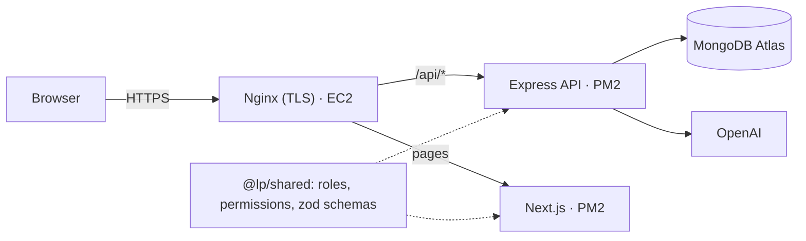
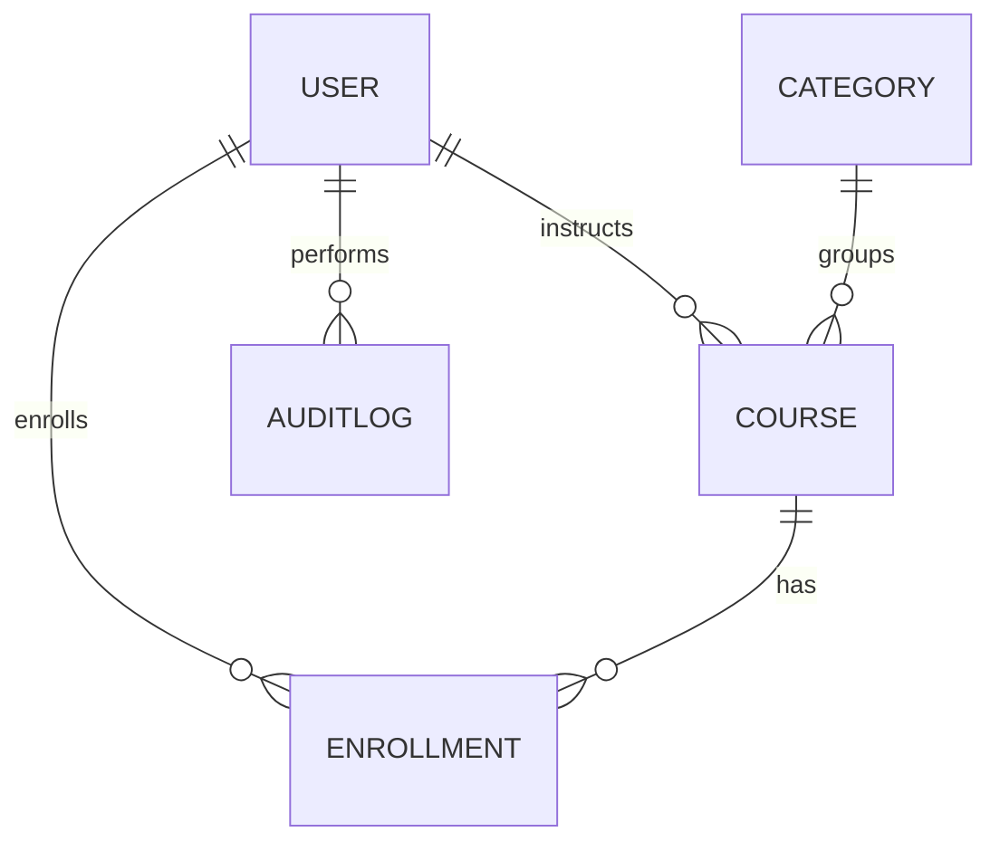

# LearnHub: Learning Platform with AI Course Recommendations

A full-stack online learning platform. Students browse and enroll in courses and get **AI
recommendations that only point to real, enrollable courses**. Instructors publish courses and see
who enrolled. Admins moderate the platform and manage course categories, and a single super admin
manages the admins.

|                         |                                    |
| ----------------------- | ---------------------------------- |
| **Live site**           | https://learnhub.mrt.lk            |
| **AI advisor (guests)** | https://learnhub.mrt.lk/advisor    |
| **API docs (Swagger)**  | https://learnhub.mrt.lk/api/docs/  |
| **API health**          | https://learnhub.mrt.lk/api/health |            |

## Demo accounts

Created by `npm run seed` (full demo data) or `npm run seed -- --small` (a handful of rows). Every
password is `Password123!` unless `SEED_PASSWORD` / `SUPERADMIN_PASSWORD` are set in
`apps/api/.env`. The login page has one-click buttons for these accounts.

| Role                 | Username     | What to try                                                        |
| -------------------- | ------------ | ------------------------------------------------------------------ |
| Student              | `student`    | Browse → enroll → My courses → AI advisor → Account                |
| Instructor           | `instructor` | Create a course, archive it, view enrolled students                |
| Instructor (pending) | `pending`    | Signs in, but can't publish until an admin approves                |
| Admin                | `admin`      | Approve `pending`, suspend a student, moderate courses, categories |
| Super admin          | `superadmin` | Create/remove admins, change roles, audit log                      |
| Guest                | (no account) | Browse the catalog and try the AI advisor at `/advisor`            |

## Features

**Guests** can browse and search the catalog and try the **AI advisor** without an account
(5 requests per 15 minutes per IP).

**Students**

- Browse, search (partial words) and filter courses by category and level, with pagination.
- Course pages with the lesson outline; enroll with a success message.
- "My courses" with status; mark courses completed or leave them.
- **AI advisor**: "I want to be a software engineer, what courses should I follow?" returns a
  summary plus 3–5 real courses, each with a reason and an Enroll button.
- **3-question onboarding** after sign-up (fields, experience level, goal): instant suggestions,
  one-click filtered catalog links, and the answers are given to the AI advisor as context.
- Archived courses stay open to students already enrolled in them.

**Everyone signed in** has an Account page to see their profile and change their password (which
signs out their other sessions).

**Instructors** create, edit, archive and delete their own courses (title, description, category,
level, draft/published/archived, ordered lessons) and see a table of enrolled students (name,
email, date). New instructors start **pending** until an admin approves them.

**Admins**

- Stats dashboard (MongoDB aggregations).
- User list with filters; suspend and reactivate users below their role, **effective on the user's
  next request**; approve instructors.
- Publish, unpublish, archive, edit or delete any course, and view any course's students.
- **Course categories**: add, rename and hide them from the Categories page. Renaming updates every
  course and student interest that uses the category; hiding stops new use but keeps existing
  courses.

**Super admin**: everything an admin can do, plus create and remove admins, change roles, and view
the audit log of every privileged action.

## Tech stack, and why

| Layer      | Choice                                                                             | Why                                                                                                  |
| ---------- | ---------------------------------------------------------------------------------- | ---------------------------------------------------------------------------------------------------- |
| Language   | **TypeScript** (strict) in the API, web app and shared package                     | Domain and request types come from one set of zod schemas; `npm run typecheck` runs `tsc` everywhere |
| Frontend   | **Next.js 16** (App Router), React 19, Tailwind CSS 4                              | File-based routing, `proxy.ts` for pre-render role redirects, rewrites make the API same-origin      |
| Backend    | **Express 5** on Node 22                                                           | Minimal and explicit; Express 5 forwards async errors to the error handler natively                  |
| Database   | **MongoDB Atlas** + Mongoose 9                                                     | Flexible course content; unique indexes enforce invariants; transactions for cascade deletes         |
| Auth       | JWT in an **httpOnly cookie**, bcrypt (cost 12)                                    | Scripts can't read the token; `tokenVersion` makes suspension and role changes instant               |
| Validation | **zod 4** in a shared package                                                      | The same schema validates the React form and the API request                                         |
| AI         | **OpenAI** chat completions (JSON mode)                                            | Grounded on the real catalog; every returned id is re-validated server-side                          |
| Quality    | Vitest, Supertest, mongodb-memory-server, ESLint, Prettier, GitHub Actions         | 105 API tests against a real (in-memory) MongoDB replica set, 10 web tests, CI on every push         |
| Docs       | OpenAPI 3 + swagger-ui                                                             | Live, try-it-out documentation at `/api/docs`                                                        |
| Hosting    | AWS EC2 t3.micro (free tier): Nginx + PM2 + Let's Encrypt · Cloudflare DNS · Atlas | One origin for pages and API, HTTPS end to end, runs on the free tier                                |

## Architecture



Pages and `/api/*` are served from one hostname, so the auth cookie is first-party and
`sameSite: 'lax'` works without CORS. The web app can also run on Vercel, with `/api/*` rewritten
to the EC2 API. Request lifecycles and the full folder structure are in
[docs/ARCHITECTURE.md](docs/ARCHITECTURE.md).

```
apps/api         Express API: routes → middleware → controllers → services → models
apps/web         Next.js app: proxy.ts guards, contexts, pages per role
packages/shared  roles, permission map, constants, zod schemas + inferred types
docs/            architecture, data model, decisions, deployment, openapi.json
deploy/          Nginx configs, deploy scripts (PM2 configs live in each app)
.github/         CI workflow
```

## Data model



- **Enrollment is its own collection** with a **compound unique index** `(student, course)`, so
  duplicate enrollment is impossible even under concurrent requests (tested).
- A **partial unique index** on `role: 'superadmin'` guarantees exactly one super admin at the
  database level.
- **Categories live in the database** (six defaults on a fresh database); courses reference them by
  name, and categories are hidden, never deleted.
- `tokenVersion` on User makes revocation instant; `enrollmentCount` is denormalized for cheap lists.

Full schemas and the reason for each index: [docs/DATABASE.md](docs/DATABASE.md).

## Permission matrix

| Action                                   | Guest | Student |     Instructor     |        Admin        | Super admin |
| ---------------------------------------- | :---: | :-----: | :----------------: | :-----------------: | :---------: |
| Browse / view published courses          |  ✅   |   ✅    |         ✅         |         ✅          |     ✅      |
| AI recommendations                       |  ✅   |   ✅    |         ❌         |         ❌          |     ❌      |
| Enroll, leave, view own enrollments      |  ❌   |   ✅    |         ❌         |         ❌          |     ❌      |
| Onboarding answers and suggestions       |  ❌   |   ✅    |         ❌         |         ❌          |     ❌      |
| Account page, change own password        |  ❌   |   ✅    |         ✅         |         ✅          |     ✅      |
| Create course                            |  ❌   |   ❌    | ✅ (once approved) |         ❌          |     ❌      |
| Edit / archive / delete **own** course   |  ❌   |   ❌    |         ✅         |          —          |      —      |
| Edit / unpublish / delete **any** course |  ❌   |   ❌    |         ❌         |         ✅          |     ✅      |
| View enrolled students                   |  ❌   |   ❌    |      own only      |         any         |     any     |
| Approve pending instructors              |  ❌   |   ❌    |         ❌         |         ✅          |     ✅      |
| Suspend / reactivate users               |  ❌   |   ❌    |         ❌         | ✅ lower roles only |     ✅      |
| Add, rename, hide course categories      |  ❌   |   ❌    |         ❌         |         ✅          |     ✅      |
| Platform stats                           |  ❌   |   ❌    |         ❌         |         ✅          |     ✅      |
| Create / remove admins, change roles     |  ❌   |   ❌    |         ❌         |         ❌          |     ✅      |
| Audit log                                |  ❌   |   ❌    |         ❌         |         ❌          |     ✅      |

Two independent rules are always enforced server-side: **permission** (does the role have
`course:delete:any`?) and **ownership/hierarchy** (is this _your_ course? is the target's role
_strictly lower_ than yours?). Frontend guards only hide what a role can't do; the API re-checks
everything, re-reading the user from the database on every request.

## API

35 endpoints, all documented and runnable in Swagger at **`/api/docs/`**. For Postman, import
[`docs/openapi.json`](docs/openapi.json).

| Area        | Endpoints                                                                                                                                                                                                                                                                  |
| ----------- | -------------------------------------------------------------------------------------------------------------------------------------------------------------------------------------------------------------------------------------------------------------------------- |
| Auth        | `POST /auth/register` · `POST /auth/login` · `POST /auth/logout` · `GET /auth/me` · `PUT /auth/me/password` · `PUT /auth/me/preferences`                                                                                                                                   |
| Courses     | `GET /courses?search&category&level&page&limit` · `GET /courses/:id` · `POST /courses` · `PUT /courses/:id` · `DELETE /courses/:id` · `GET /courses/mine` · `GET /courses/suggested` · `GET /courses/:id/students`                                                         |
| Categories  | `GET /categories`                                                                                                                                                                                                                                                          |
| Enrollments | `POST /enrollments` · `GET /enrollments/me` · `PATCH /enrollments/:id/complete` · `DELETE /enrollments/:id`                                                                                                                                                                |
| AI          | `POST /recommendations` (guests and students)                                                                                                                                                                                                                              |
| Admin       | `GET /admin/stats` · `GET /admin/users` · `PATCH /admin/users/:id/status` · `PATCH /admin/instructors/:id/approve` · `GET /admin/courses` · `PATCH /admin/courses/:id/status` · `DELETE /admin/courses/:id` · `GET/POST /admin/categories` · `PATCH /admin/categories/:id` |
| Super admin | `POST/GET /superadmin/admins` · `DELETE /superadmin/admins/:id` · `PATCH /superadmin/users/:id/role` · `GET /superadmin/audit-logs`                                                                                                                                        |

Also `GET /api/health` (status, database connection and the client IP the API sees).

Conventions: success `{ success: true, data, meta? }`; error `{ success: false, message, errors? }`;
status codes 400 validation · 401 not signed in · 403 not allowed · 404 · 409 duplicate or conflict
· 413 body too large · 429 rate limited · 502 AI provider failure · 503 AI not configured.

## How the AI recommendations stay grounded

1. Retrieve the published catalog (compact projection) from MongoDB.
2. Tell the model to choose **only** from that list and reply in strict JSON. For signed-in
   students, their onboarding answers are added as context.
3. Parse defensively (strip code fences; a bad reply becomes a friendly 502).
4. **Re-validate every returned `courseId`** against the catalog: invented, duplicate or unpublished
   ids are dropped.

The key never leaves the server. Requests time out after 20 s and are rate-limited per 15 minutes:
10 per signed-in student (`AI_RATE_LIMIT`), 5 per guest IP (`AI_GUEST_RATE_LIMIT`). GPT-3 is
retired, so a current small model is used (`OPENAI_MODEL`, default `gpt-5.4-mini`). This
substitution was deliberate.

## Running locally

Prerequisites: **Node 22+** and a MongoDB database. Atlas (free tier) works; it must be a replica
set, which Atlas always is, because course deletion uses a transaction. Without Atlas,
`npm run db:local -w @lp/api` starts a local one.

```bash
npm install
cp apps/api/.env.example apps/api/.env      # set MONGODB_URI, JWT_SECRET, OPENAI_API_KEY
cp apps/web/.env.example apps/web/.env.local
npm run seed -- --small                     # demo data (add --yes for a remote database)
npm run dev                                 # API on :5000, web on :3000
```


**OpenAI key:** paste it into `apps/api/.env` on **one line** (`OPENAI_API_KEY=sk-proj-…`, about
160 characters; turn off word wrap if your editor splits it), restart the API, then run
`npm run ai:check` once. It makes a single tiny request and explains any failure. Nothing else
calls OpenAI except clicking **Get recommendations**: tests, CI, builds and page loads never do.

| Command                                 | What it does                                                                                    |
| --------------------------------------- | ----------------------------------------------------------------------------------------------- |
| `npm run dev`                           | API (tsx watch) + web with reload                                                               |
| `npm test`                              | 105 API tests (in-memory MongoDB; the first run downloads a MongoDB binary) + 10 web tests      |
| `npm run typecheck`                     | `tsc` in strict mode across all three workspaces                                                |
| `npm run lint` / `npm run format:check` | ESLint / Prettier                                                                               |
| `npm run build`                         | Production build of the web app (`npm run build -w @lp/api` bundles the API)                    |
| `npm run seed`                          | Reset to the full demo data: 9 users, 20 courses (refuses a remote database without `-- --yes`) |
| `npm run seed -- --small`               | Same, with a small dataset: 7 users, 6 courses, 3 enrollments                                   |
| `npm run create-superadmin`             | Idempotently create the super admin from `SUPERADMIN_*` env vars                                |
| `npm run ai:check`                      | Test `OPENAI_API_KEY` + `OPENAI_MODEL` with one tiny request, with hints on failure             |
| `npm run db:local -w @lp/api`           | Local MongoDB (replica set) on port 27018, for working without Atlas                            |
| `npm run docs:openapi`                  | Regenerate `docs/openapi.json`                                                                  |

### Environment variables

**API (`apps/api/.env`)**

| Variable                                       | Purpose                                                                             |
| ---------------------------------------------- | ----------------------------------------------------------------------------------- |
| `MONGODB_URI`                                  | Connection string **including the database name**, e.g. `…mongodb.net/GPT_LMS?…`    |
| `JWT_SECRET`, `JWT_EXPIRES_IN`                 | Token signing secret (≥32 characters in production) and lifetime (default `1d`)     |
| `PORT`, `NODE_ENV`, `CLIENT_ORIGIN`            | Port (5000), environment, origins allowed to call the API directly                  |
| `OPENAI_API_KEY`, `OPENAI_MODEL`               | OpenAI key (one line) and model (default `gpt-5.4-mini`)                            |
| `OPENAI_TIMEOUT_MS`, `OPENAI_REASONING_EFFORT` | Request timeout (20000) and optional effort for reasoning models                    |
| `AI_RATE_LIMIT`, `AI_GUEST_RATE_LIMIT`         | Advisor requests per 15 minutes per student (10) and per guest IP (5)               |
| `TRUST_PROXY`                                  | Proxies in front of the API: `1` locally or behind Nginx, `2` behind Vercel + Nginx |
| `SUPERADMIN_NAME/USERNAME/EMAIL/PASSWORD`      | Used by `create-superadmin` and `seed` (password ≥8 characters)                     |
| `SEED_PASSWORD`                                | Password for every seeded demo account (default `Password123!`)                     |

**Web (`apps/web/.env.local` locally, `.env.production` on the server)**: `API_URL` (where
`/api/*` is proxied; read at build time) and `NEXT_PUBLIC_DEMO_MODE` (`false` hides the
demo-account buttons).

## Deployment

The live site runs on a single AWS free-tier EC2 instance (t3.micro, Ubuntu, with an Elastic IP).
Nginx terminates HTTPS with a Let's Encrypt certificate, then sends `/api/*` to the Express API and
everything else to Next.js, both kept running by PM2. DNS is a Cloudflare A record for
`learnhub.mrt.lk`, and the data lives in MongoDB Atlas.

```bash
bash deploy/deploy.sh # on the server: pull, install, type-check, build both apps, reload PM2, health checks
```

Step-by-step setup (AWS, server, `.env`, domain and HTTPS, Cloudflare proxy, verification) and the
alternative Vercel + EC2 split: [docs/DEPLOYMENT.md](docs/DEPLOYMENT.md).

## Design decisions

- **Separate Enrollment collection** with a compound unique index. Duplicates are blocked by the
  database, not just by an app check.
- **`tokenVersion` revocation**: suspension, role changes and password changes end sessions
  immediately; the token only ever travels in an httpOnly cookie.
- **Partial unique index** for the single super admin, created by a script rather than an endpoint.
- **Permissions and ownership are separate checks**; the permission map lives in the shared package.
- **Grounded AI**: retrieve, constrain, then re-validate ids; open to guests with a lower limit.
- **Categories are data**: admins manage them without a deploy; renames propagate, nothing is
  deleted.
- **Monorepo with a shared TypeScript package**: validation rules _and_ the types inferred from
  them can't drift between client and server.
- **Hard delete cascades in a transaction**; archiving is offered as the non-destructive option.
- **Safety rails**: the seed script refuses remote databases without `--yes`, and an instructor's
  role can't be changed while they still own courses.

Longer write-up with trade-offs: [docs/DECISIONS.md](docs/DECISIONS.md).

## Known limitations and future work

Refresh tokens, email verification and forgotten-password reset by email, a Redis-backed rate
limiter for multi-instance deploys, Atlas Search for fuzzy search at scale, per-lesson progress,
file uploads, payments, automatic deployment from CI, and browser (end-to-end) tests in CI.

GitHub Actions already runs formatting, lint, type-check, all tests and both builds on every push
and pull request ([`.github/workflows/ci.yml`](.github/workflows/ci.yml)).
