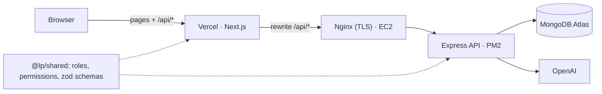
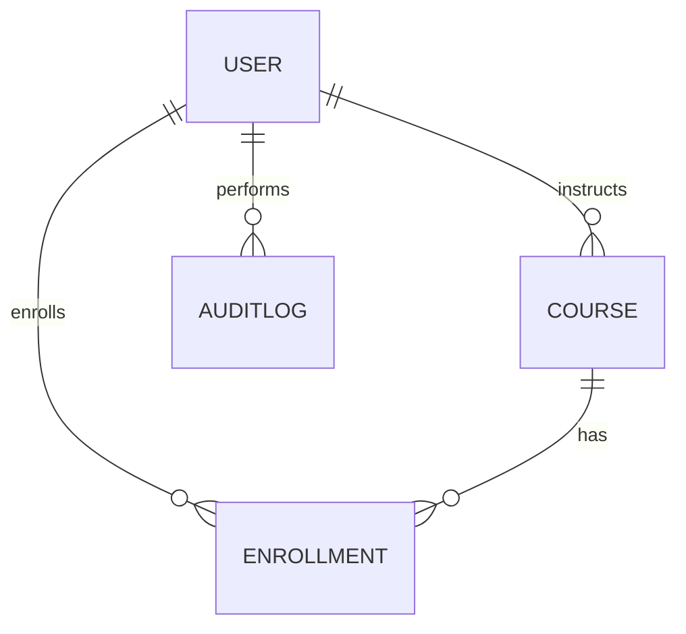

# LearnHub: Learning Platform with AI Course Recommendations

A full-stack online learning platform. Students browse and enroll in courses and get **AI
recommendations that only point to real, enrollable courses**. Instructors publish courses and see
who enrolled. Admins moderate the platform, and a single super admin manages the admins.

|                        |                                                     |
| ---------------------- | --------------------------------------------------- |
| **Frontend**           | https://YOUR-APP.vercel.app <!-- TODO: live URL --> |
| **API**                | https://api.YOUR-DOMAIN <!-- TODO: live URL -->     |
| **API docs (Swagger)** | https://YOUR-APP.vercel.app/api/docs/               |
| **Demo video**         | <!-- TODO: link -->                                 |

## Demo accounts

Seeded by `npm run seed`. Every password is `Password123!`. The login page also has one-click
buttons for these accounts.

| Role                 | Username     | What to try                                            |
| -------------------- | ------------ | ------------------------------------------------------ |
| Student              | `student`    | Browse → enroll → My courses → AI advisor              |
| Instructor           | `instructor` | Create a course, view enrolled students                |
| Instructor (pending) | `pending`    | Signs in, but can't publish until approved             |
| Admin                | `admin`      | Approve `pending`, suspend a student, moderate courses |
| Super admin          | `superadmin` | Create/remove admins, change roles, audit log          |

## Features

**Students**: browse, search and filter courses (category, level, pagination); view course
details and the lesson outline; enroll with a success message; see "My courses" with status and
mark courses completed; AI advisor ("I want to be a software engineer, what courses should I
follow?") returns a summary plus 3–5 real courses with a reason each and an Enroll button.

**Instructors**: create, edit and delete their own courses (title, description, category, level,
draft/published/archived, ordered lessons); view a table of enrolled students (name, email, date).
New instructors start **pending** until an admin approves them.

**Admins**: stats dashboard (MongoDB aggregations); user list with filters; suspend and reactivate
users below their role, **effective on the user's next request**; approve instructors; publish,
unpublish, archive or delete any course.

**Super admin**: everything an admin can do, plus create and remove admins, change roles, and view
the audit log of every privileged action.

## Tech stack, and why

| Layer      | Choice                                                                              | Why                                                                                                               |
| ---------- | ----------------------------------------------------------------------------------- | ----------------------------------------------------------------------------------------------------------------- |
| Language   | **TypeScript** (strict) in the API, web app and shared package                      | Domain and request types come from one set of zod schemas; `npm run typecheck` runs `tsc` everywhere              |
| Frontend   | **Next.js 16** (App Router), React 19, Tailwind CSS 4                               | File-based routing, `proxy.ts` for pre-render role redirects, rewrites make the API same-origin                   |
| Backend    | **Express 5** on Node 22                                                            | Minimal and explicit; Express 5 forwards async errors to the error handler natively                               |
| Database   | **MongoDB Atlas** + Mongoose 9                                                      | Flexible course content; partial and compound unique indexes enforce invariants; transactions for cascade deletes |
| Auth       | JWT in an **httpOnly cookie**, bcrypt (cost 12)                                     | XSS can't read the token; `tokenVersion` enables instant revocation                                               |
| Validation | **zod 4** in a shared package                                                       | The same schema validates the React form and the API request                                                      |
| AI         | **OpenAI** chat completions (JSON mode)                                             | Grounded on the real catalog; every id re-validated server-side                                                   |
| Quality    | Vitest + Supertest + mongodb-memory-server, ESLint 10 + typescript-eslint, Prettier | 73 API tests against a real (in-memory) MongoDB replica set                                                       |
| Docs       | OpenAPI 3 + swagger-ui                                                              | Live, try-it-out documentation at `/api/docs`                                                                     |
| Hosting    | Vercel (web) · EC2 + Nginx + PM2 + certbot (API) · Atlas                            | HTTPS end to end; Atlas allow-lists only the EC2 IP                                                               |

## Architecture



The browser only talks to the Vercel origin. `/api/*` is rewritten to the API, so the auth cookie
is first-party and `sameSite: 'lax'` works without CORS. More detail, including request lifecycles
and folder structure, is in [docs/ARCHITECTURE.md](docs/ARCHITECTURE.md).

```
apps/api         Express API: routes → middleware → controllers → services → models
apps/web         Next.js app: proxy.ts guards, contexts, pages per role
packages/shared  roles, permission map, status constants, zod schemas + inferred types
docs/            architecture, data model, decisions, deployment, openapi.json
deploy/          Nginx config, API deploy script
```

## Data model



- **Enrollment is its own collection** with a **compound unique index** `(student, course)`, so
  duplicate enrollment is impossible even under concurrent requests (tested).
- A **partial unique index** on `role: 'superadmin'` guarantees exactly one super admin at the
  database level.
- `tokenVersion` on User makes revocation instant; `enrollmentCount` is denormalized for cheap lists.

Full schemas and the rationale for each index: [docs/DATABASE.md](docs/DATABASE.md).

## Permission matrix

| Action                                   | Student |     Instructor     |        Admin        | Super admin |
| ---------------------------------------- | :-----: | :----------------: | :-----------------: | :---------: |
| Browse / view published courses          |   ✅    |         ✅         |         ✅          |     ✅      |
| Enroll, view own enrollments             |   ✅    |         ❌         |         ❌          |     ❌      |
| AI recommendations                       |   ✅    |         ❌         |         ❌          |     ❌      |
| Create course                            |   ❌    | ✅ (once approved) |         ❌          |     ❌      |
| Edit / delete **own** course             |   ❌    |         ✅         |          —          |      —      |
| Edit / unpublish / delete **any** course |   ❌    |         ❌         |         ✅          |     ✅      |
| View enrolled students                   |   ❌    |      own only      |         any         |     any     |
| Approve pending instructors              |   ❌    |         ❌         |         ✅          |     ✅      |
| Suspend / reactivate users               |   ❌    |         ❌         | ✅ lower roles only |     ✅      |
| Create / remove admins, change roles     |   ❌    |         ❌         |         ❌          |     ✅      |
| Platform stats                           |   ❌    |         ❌         |         ✅          |     ✅      |
| Audit log                                |   ❌    |         ❌         |         ❌          |     ✅      |

Two independent rules are always enforced server-side: **permission** (does the role have
`course:delete:any`?) and **ownership/hierarchy** (is this _your_ course? is the target's role
_strictly lower_ than yours?). Frontend guards only hide what a role can't do; the API
re-checks everything, re-reading the user from the database on every request.

## API

27 endpoints, all documented and runnable in Swagger at **`/api/docs/`**. For Postman, import
[`docs/openapi.json`](docs/openapi.json).

| Area        | Endpoints                                                                                                                                                                                                   |
| ----------- | ----------------------------------------------------------------------------------------------------------------------------------------------------------------------------------------------------------- |
| Auth        | `POST /auth/register` · `POST /auth/login` · `POST /auth/logout` · `GET /auth/me`                                                                                                                           |
| Courses     | `GET /courses?search&category&level&page&limit` · `GET /courses/:id` · `POST /courses` · `PUT /courses/:id` · `DELETE /courses/:id` · `GET /courses/mine` · `GET /courses/:id/students`                     |
| Enrollments | `POST /enrollments` · `GET /enrollments/me` · `PATCH /enrollments/:id/complete`                                                                                                                             |
| AI          | `POST /recommendations`                                                                                                                                                                                     |
| Admin       | `GET /admin/stats` · `GET /admin/users` · `PATCH /admin/users/:id/status` · `PATCH /admin/instructors/:id/approve` · `GET /admin/courses` · `PATCH /admin/courses/:id/status` · `DELETE /admin/courses/:id` |
| Super admin | `POST/GET /superadmin/admins` · `DELETE /superadmin/admins/:id` · `PATCH /superadmin/users/:id/role` · `GET /superadmin/audit-logs`                                                                         |

Conventions: success `{ success: true, data, meta? }`; error `{ success: false, message, errors? }`;
status codes 400 validation · 401 not signed in · 403 not allowed · 404 · 409 duplicate · 429 rate
limited · 502 AI provider failure.

## How the AI recommendations stay grounded

1. Retrieve the published catalog (compact projection) from MongoDB.
2. Tell the model to choose **only** from that list and reply in strict JSON.
3. Parse defensively (strip code fences; a bad reply becomes a friendly 502).
4. **Re-validate every returned `courseId`** against the catalog: invented, duplicate or unpublished
   ids are dropped.

The key never leaves the server. Requests time out after 20 s and are rate-limited to 10 per user
per 15 minutes. GPT-3 is retired, so a current small model is used (`OPENAI_MODEL`, default
`gpt-5.4-mini`). This substitution was deliberate.

## Running locally

Prerequisites: **Node 22+** and a MongoDB connection string (Atlas free tier works; it must be a
replica set, which Atlas always is, because course deletion uses a transaction).

```bash
npm install
cp apps/api/.env.example apps/api/.env      # set MONGODB_URI, JWT_SECRET, OPENAI_API_KEY
cp apps/web/.env.example apps/web/.env.local
npm run seed                                # demo users + 20 courses (wipes the database)
npm run dev                                 # API on :5000, web on :3000
```

Open http://localhost:3000 and sign in with a demo account.

| Command                                 | What it does                                                                 |
| --------------------------------------- | ---------------------------------------------------------------------------- |
| `npm run dev`                           | API + web with reload                                                        |
| `npm test`                              | 73 API tests (in-memory MongoDB; the first run downloads a MongoDB binary)   |
| `npm run typecheck`                     | `tsc` in strict mode across all three workspaces                             |
| `npm run lint` / `npm run format:check` | ESLint / Prettier                                                            |
| `npm run build`                         | Production build of the web app (`npm run build -w @lp/api` bundles the API) |
| `npm run seed`                          | Reset to demo data (refuses in production without `-- --yes`)                |
| `npm run create-superadmin`             | Idempotently create the super admin from `SUPERADMIN_*` env vars             |
| `npm run docs:openapi`                  | Regenerate `docs/openapi.json`                                               |

### Environment variables

**API (`apps/api/.env`)**: `MONGODB_URI`, `JWT_SECRET` (≥32 chars in production),
`JWT_EXPIRES_IN` (default `1d`), `PORT` (5000), `CLIENT_ORIGIN`, `OPENAI_API_KEY`, `OPENAI_MODEL`,
`OPENAI_TIMEOUT_MS`, `AI_RATE_LIMIT`, `SUPERADMIN_NAME/USERNAME/EMAIL/PASSWORD`, `SEED_PASSWORD`.
See [`apps/api/.env.example`](apps/api/.env.example).

**Web (`apps/web/.env.local` / Vercel)**: `API_URL`, `NEXT_PUBLIC_DEMO_MODE`.

## Deployment

Vercel (root directory `apps/web`, env `API_URL`) → EC2 running Nginx (TLS by certbot) in front of
PM2 → Express → MongoDB Atlas (network access limited to the EC2 Elastic IP). Step-by-step
instructions, the Nginx config and the deploy script: [docs/DEPLOYMENT.md](docs/DEPLOYMENT.md).

## Design decisions

- **Separate Enrollment collection** with a compound unique index. Duplicates are blocked by the
  database, not just by an app check.
- **`tokenVersion` revocation**: suspension and role changes end sessions immediately.
- **Partial unique index** for the single super admin, created by a script rather than an endpoint.
- **Permissions and ownership are separate checks**; the permission map lives in the shared package.
- **Grounded AI**: retrieve, constrain, then re-validate ids.
- **Monorepo with a shared TypeScript package**: validation rules _and_ the types inferred from
  them can't drift between client and server.
- **Hard delete cascades in a transaction**; archiving is offered as the non-destructive option.

Longer write-up with trade-offs: [docs/DECISIONS.md](docs/DECISIONS.md).

## Known limitations and future work

Refresh tokens, email verification and password reset, a Redis-backed rate limiter for
multi-instance deploys, Atlas Search for prefix/fuzzy search, per-lesson progress, file uploads,
payments, and a CI/CD pipeline (GitHub Actions running lint, tests and build on every PR).
