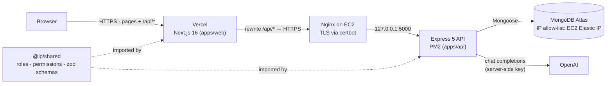
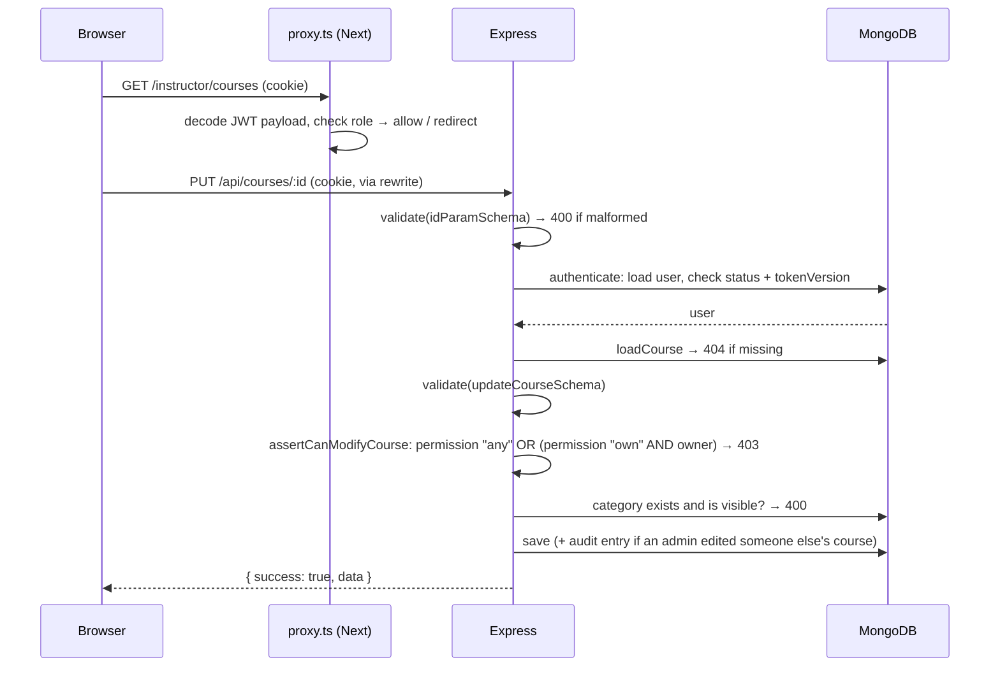

# Architecture

## System overview



**Why the browser only ever talks to Vercel.** `next.config.ts` rewrites `/api/*` to the EC2 API,
so from the browser's point of view the API is same-origin. The auth cookie is therefore
first-party, `sameSite: 'lax'` works, there is no CORS preflight on every request, and the EC2
hostname never appears in client code. Because each request passes two proxies (Vercel, then
Nginx), the API runs with `TRUST_PROXY=2` in production so `req.ip` is the visitor.

## Request lifecycle (protected write)



`proxy.ts` and `RoleGate` only improve UX (no flash of forbidden pages). They read the JWT payload
without verifying it. **Every rule is enforced by the API**, which re-reads the user from the
database on every request. The proxy deliberately leaves `/login` and `/register` alone: those
pages redirect signed-in users themselves, after the API has confirmed the session, so a stale
cookie can never lock anyone out of the login page.

## AI recommendation flow

```mermaid
sequenceDiagram
    participant B as Browser (guest or student)
    participant A as Express
    participant D as MongoDB
    participant O as OpenAI
    B->>A: POST /api/recommendations { prompt }
    A->>A: optionalAuth · students or guests only · rate limit (per user / per IP)
    A->>D: published catalog (id, title, category, level, short description)
    A->>O: system prompt = catalog (+ student's onboarding answers) · user = prompt · JSON mode
    O-->>A: { recommendations: [{ courseId, reason }], summary }
    A->>A: drop ids not in the catalog, duplicates; cap at 5
    A-->>B: { summary, recommendations: [{ course, reason }] }
```

Provider failures become a 502 with a retry message; a missing key is a 503. The
`openai.client.ts` module is the only place that talks to OpenAI, and the tests replace it with a
mock, so no test ever spends a request.

## Backend layout (`apps/api/src`)

Strict TypeScript. Development runs through `tsx watch`; production is a single esbuild bundle
(`dist/server.js`) with npm dependencies left external. `npm run typecheck` runs `tsc`.

```
app.ts              createApp(): proxy trust, swagger, helmet, cors, 1 MB JSON limit, cookies,
                    /api/health, routes, error handler
server.ts           env check → connect DB → default categories → listen; graceful shutdown
routes/             URL → middleware chain → controller (reads like the permission matrix)
middleware/         authenticate, optionalAuth, authorize(permission), allowGuestsOr(permission),
                    requireActive, validate(schema), loadCourse, rateLimit, errorHandler
controllers/        HTTP only: read req, call a service, send { success, data, meta }
services/           business rules:
  course            ownership checks, search, cascade delete
  enrollment        enroll (duplicate-safe), complete, leave
  category          defaults, add/rename/hide, "is this category usable?"
  preferences       onboarding answers and rule-based suggestions
  recommendation    grounded AI (+ ai/openai.client.ts)
  admin, superadmin user management, stats, course moderation, admins, roles
  rbac, audit       hierarchy rule (assertCanManage) and audit log
  auth, bootstrap   register/login/password change, JWT; single super admin
models/             User, Course, Enrollment, Category, AuditLog (schemas + indexes)
docs/openapi.ts     OpenAPI 3 spec served at /api/docs
types/express.d.ts  what middleware attaches to req (user, course, validated)
utils/              request.ts (currentUser, validated), cookies, respond, database (isLocal…)
scripts/            seed (--small, refuses remote DBs without --yes), createSuperAdmin,
                    checkAi (one request), localDb, exportOpenapi
```

Errors are thrown as `new ApiError(status, message)`; Express 5 forwards rejected promises to the
central `errorHandler`, which also maps Mongoose `CastError`, duplicate keys (`11000` → 409) and
malformed or oversized JSON to proper status codes.

## Frontend layout (`apps/web/src`)

```
proxy.ts            role-based redirects before render for /admin, /instructor, /student, /account
lib/api.ts          the only fetch wrapper (generic api<Course>(…)): same-origin, credentials,
                    error normalization; announces "session ended" when the API revokes a session
context/            AuthContext (user, login, logout, updateUser, can()), Toast, Confirm dialog
hooks/              useApiData (loading/error/reload), useForm (shared zod schemas),
                    useCategories (visible categories), useRedirectIfSignedIn (login/register)
components/         ui primitives, States (loading/empty/error), CourseCard, CourseForm,
                    Suggestions (For you, filter shortcuts), HomeActions, RoleGate, Header,
                    manage/ (course edit + students views shared by instructors and admins)
app/
  /, /courses, /courses/[id], /advisor                      public (the advisor works for guests)
  /login, /register, /account                               auth and account
  /student/my-courses, /student/onboarding                  students
  /instructor/courses (+ new, [id]/edit, [id]/students)     instructors
  /admin (+ users, instructors, courses, courses/[id]/…,    admins; admins and audit-logs are
          categories, admins, audit-logs)                   super admin only
```

## The shared package (`packages/shared`)

One source of truth imported by both apps:

| Export                                       | Used by the API for                | Used by the web app for              |
| -------------------------------------------- | ---------------------------------- | ------------------------------------ |
| `ROLES`, `ROLE_LEVEL`, `outranks()`          | hierarchy guard                    | hiding actions on higher roles       |
| `PERMISSIONS`, `can()`                       | `authorize(permission)` middleware | building menus                       |
| zod schemas                                  | `validate(schema)` middleware      | form validation with identical rules |
| `z.infer` types (`RegisterInput`, `Role`, …) | typed service signatures           | typed form values and API calls      |
| `DEFAULT_COURSE_CATEGORIES`                  | categories for a fresh database    | —                                    |
| `LEARNING_GOAL_LABELS`, `COURSE_LEVELS`      | AI prompt context, validation      | onboarding and filter options        |
| `ROLE_HOME`                                  | —                                  | post-login redirect                  |

## Tests and CI

- **API:** 105 Vitest + Supertest tests against an in-memory MongoDB replica set (one database per
  test file). OpenAI is mocked.
- **Web:** 10 tests for the route guard (`proxy.ts`) and the API client.
- **CI:** `.github/workflows/ci.yml` runs formatting, lint, type-check, both test suites and both
  builds on every push and pull request.
