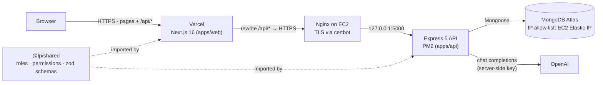
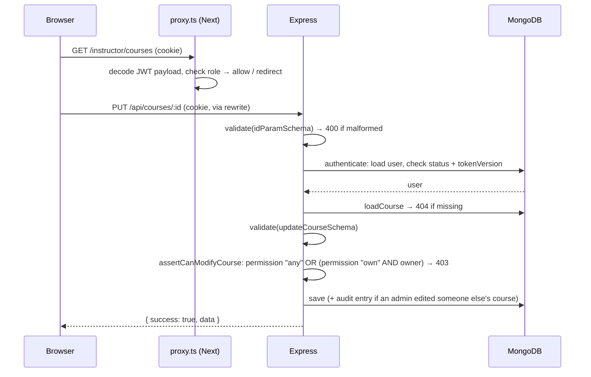

# Architecture

## System overview



**Why the browser only ever talks to Vercel.** `next.config.mjs` rewrites `/api/*` to the EC2 API, so
from the browser's point of view the API is same-origin. The auth cookie is therefore first-party,
`sameSite: 'lax'` works, there is no CORS preflight on every request, and the EC2 hostname never
appears in client code.

## Request lifecycle (protected write)



`proxy.ts` and `RoleGate` only improve UX (no flash of forbidden pages). They read the JWT payload
without verifying it. **Every rule is enforced by the API**, which re-reads the user from the
database on every request.

## Backend layout (`apps/api/src`)

Strict TypeScript. Development runs through `tsx watch`; production is a single esbuild bundle
(`dist/server.js`) with npm dependencies left external. `npm run typecheck` runs `tsc`.

```
app.ts              createApp(): helmet, cors, json limit, cookies, routes, swagger, error handler
server.ts           env check → connect DB → listen; graceful shutdown for PM2
routes/             URL → middleware chain → controller (reads like the permission matrix)
middleware/         authenticate, authorize(permission), requireActive, validate(schema),
                    loadCourse, rateLimit, errorHandler
controllers/        HTTP only: read req, call a service, send { success, data, meta }
services/           business rules: ownership, hierarchy (rbac.ts), audit, AI grounding
models/             User, Course, Enrollment, AuditLog (schemas + indexes)
docs/openapi.ts     OpenAPI 3 spec served at /api/docs
types/express.d.ts  what middleware attaches to req (user, course, validated)
utils/request.ts    typed accessors: currentUser(req), validated(req, 'body', schema)
scripts/            createSuperAdmin (idempotent), seed, exportOpenapi
```

Errors are thrown as `new ApiError(status, message)`; Express 5 forwards rejected promises to the
central `errorHandler`, which also maps Mongoose `CastError`, duplicate keys (`11000` → 409) and
malformed JSON to proper status codes.

## Frontend layout (`apps/web/src`)

```
proxy.ts            role-based redirects before render (Next 16's replacement for middleware)
lib/api.ts          the only fetch wrapper (generic: api<Course>(...)): same-origin, credentials, error normalization,
                    broadcasts "session ended" when the API revokes a session
context/            AuthContext (user, login, logout, can()), Toast, Confirm dialog
hooks/              useApiData (loading/error/reload), useForm (shared zod schema validation)
components/         ui primitives, States (loading/empty/error), CourseCard, CourseForm, RoleGate
app/                (auth) login/register · courses · student/* · instructor/* · admin/*
```

## The shared package (`packages/shared`)

One source of truth imported by both apps:

| Export                                       | Used by the API for                | Used by the web app for              |
| -------------------------------------------- | ---------------------------------- | ------------------------------------ |
| `ROLES`, `ROLE_LEVEL`, `outranks()`          | hierarchy guard                    | hiding actions on higher roles       |
| `PERMISSIONS`, `can()`                       | `authorize(permission)` middleware | building menus                       |
| zod schemas                                  | `validate(schema)` middleware      | form validation with identical rules |
| `z.infer` types (`RegisterInput`, `Role`, …) | typed service signatures           | typed form values and API calls      |
| `ROLE_HOME`                                  | —                                  | post-login redirect                  |
