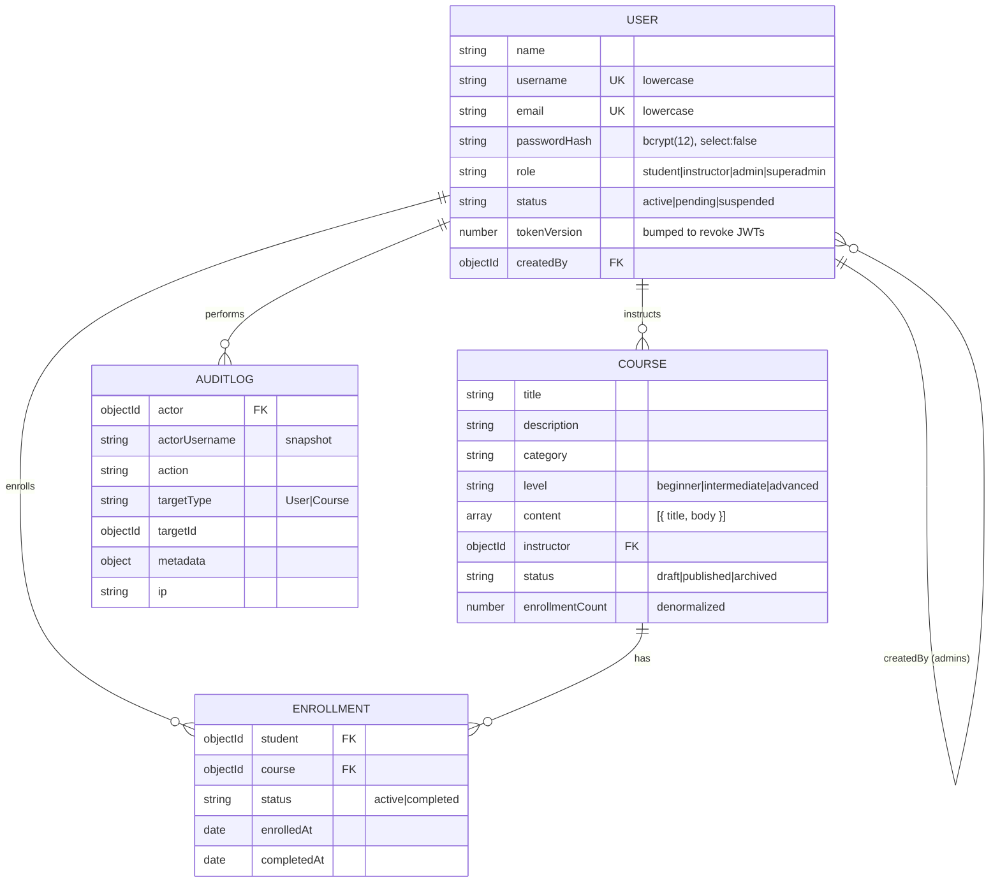

# Data model

## Indexes and why each exists

| Collection  | Index                                                     | Purpose                                                                                        |
| ----------- | --------------------------------------------------------- | ---------------------------------------------------------------------------------------------- |
| users       | `username` unique, `email` unique                         | Login lookup; no duplicate accounts (values are lowercased first)                              |
| users       | `{ role: 1 }` **unique, partial** on `role: 'superadmin'` | MongoDB itself guarantees there is exactly one super admin, even if application code has a bug |
| users       | `role`, `status`                                          | Admin user filters, pending-instructor queue                                                   |
| courses     | `instructor`                                              | "My courses"                                                                                   |
| courses     | `category`, `status`                                      | Catalog filters; public list only shows `published`                                            |
| courses     | text index on `title` (weight 3) + `description`          | `?search=` without extra infrastructure                                                        |
| enrollments | `{ student: 1, course: 1 }` **unique**                    | Duplicate enrollment is impossible, even for two simultaneous requests (tested)                |
| enrollments | `student`, `course`                                       | "My enrollments" and "students in this course"                                                 |
| auditlogs   | `actor`, `action`, `createdAt: -1`                        | Filtered, newest-first audit screen                                                            |

## Modelling decisions

- **Enrollment is its own collection**, not an array on User or Course. Arrays grow without bound
  (16 MB document limit) and can only be indexed from one side; a join collection is indexed in
  both directions and carries its own status and dates.
- **`enrollmentCount` is denormalized** onto Course and incremented with `$inc` on enrollment, so
  course lists don't run a count query per course.
- **Hard deletes cascade in a transaction.** Deleting a course removes its enrollments in the same
  MongoDB transaction, so no orphans remain. `archived` is the soft alternative and is what the UI
  suggests when a course has students.
- **Audit entries snapshot the actor's username**, so the log stays readable after an admin
  account is removed.
