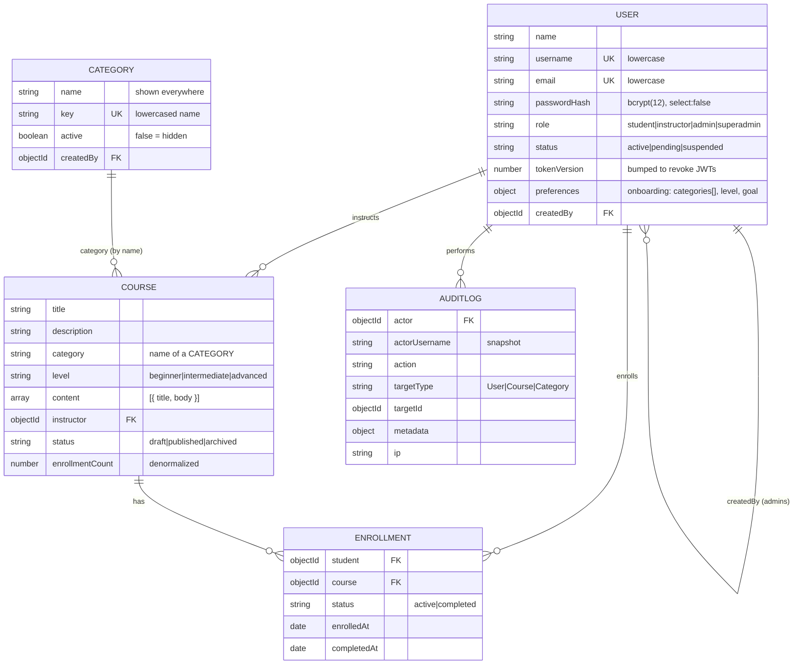

# Data model

## Collections

| Collection  | What it holds                                                                                       |
| ----------- | --------------------------------------------------------------------------------------------------- |
| users       | All accounts. Students also carry `preferences` (their 3 onboarding answers) once they answer them. |
| courses     | Courses with ordered lessons. `category` is the **name** of a category document.                    |
| categories  | Course categories managed by admins. A fresh database gets six defaults on first start.             |
| enrollments | One document per student per course.                                                                |
| auditlogs   | Every privileged action: who, what, target, details, IP.                                            |

## Indexes and why each exists

| Collection  | Index                                                     | Purpose                                                                                                         |
| ----------- | --------------------------------------------------------- | --------------------------------------------------------------------------------------------------------------- |
| users       | `username` unique, `email` unique                         | Login lookup; no duplicate accounts (values are lowercased first)                                               |
| users       | `{ role: 1 }` **unique, partial** on `role: 'superadmin'` | MongoDB itself guarantees there is exactly one super admin, even if application code has a bug                  |
| users       | `role`, `status`                                          | Admin user filters, pending-instructor queue                                                                    |
| categories  | `key` unique, `active`                                    | Case-insensitive unique names; the public list only shows visible ones                                          |
| courses     | `instructor`                                              | "My courses"                                                                                                    |
| courses     | `category`, `status`                                      | Catalog filters; the public list only shows `published`                                                         |
| courses     | sort `createdAt` + `_id` tiebreak                         | Stable newest-first pages. Search is a case-insensitive substring match, so there is no text index at this size |
| enrollments | `{ student: 1, course: 1 }` **unique**                    | Duplicate enrollment is impossible, even for two simultaneous requests (tested)                                 |
| enrollments | `student`, `course`                                       | "My enrollments" and "students in this course"                                                                  |
| auditlogs   | `actor`, `action`, `createdAt: -1`                        | Filtered, newest-first audit screen                                                                             |

## Modelling decisions

- **Enrollment is its own collection**, not an array on User or Course. Arrays grow without bound
  (16 MB document limit) and can only be indexed from one side; a join collection is indexed in
  both directions and carries its own status and dates.
- **`enrollmentCount` is denormalized** onto Course: `$inc` on enrollment, decremented when a
  student leaves, so course lists don't run a count query per course.
- **Courses reference categories by name**, which keeps filters and queries simple. Renaming a
  category therefore updates every course and every student's `preferences.categories` in the same
  request. Categories are never deleted, only hidden, so no course points at a missing category.
- **Hard deletes cascade in a transaction.** Deleting a course removes its enrollments in the same
  MongoDB transaction, so no orphans remain. `archived` is the soft alternative (enrolled students
  keep access) and is what the UI suggests when a course has students.
- **Audit entries snapshot the actor's username**, so the log stays readable after an admin
  account is removed.

## Demo data

`npm run seed` resets `users`, `courses`, `enrollments`, `auditlogs` and `categories`:

| Option       | Users | Courses                  | Enrollments |
| ------------ | ----- | ------------------------ | ----------- |
| (default)    | 9     | 20 (1 draft, 1 archived) | 9           |
| `-- --small` | 7     | 6 (1 draft)              | 3           |

It refuses to run against a non-local database unless `-- --yes` is passed.
